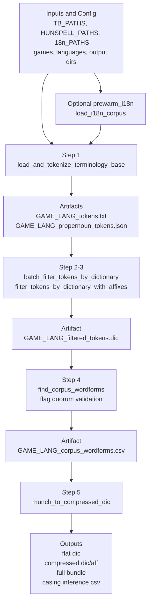

# TB2dic Pipeline - Current Workflow (Notebook vNext)

This README documents the current executable workflow centered on:

- `run_pipeline_batch()` as the main orchestrator
- `run_pipeline_single()` as the single-pair wrapper

The notebook markdown may contain historical notes. The authoritative behavior is the code path invoked by `run_pipeline_batch()`.

## What This Pipeline Produces

For each `(game, language)` pair, the workflow builds Hunspell-ready dictionary artifacts from TB data and corpus validation:

1. Token extraction from TB files (Excel/CSV/XLIFF)
2. Hunspell-based filtering against standard dictionaries
3. Corpus wordform discovery and affix flag validation
4. Compressed dictionary assembly (`.dic/.aff`) plus flat and full bundles

## Workflow Schema



## Main API

### `run_pipeline_batch()`

Runs the full 5-step pipeline for multiple games and languages.

```python
results = run_pipeline_batch(
    languages=["es", "pt"],
    games=["DOFUS", "WAKFU"],
    sample=0,
    workers=8,
    batch_size=50,
    add_verb_flags=False,
    quorum=0.5,
    cleanup_stale=True,
    strict_mode=False,
    output_folder=None,
    prewarm_i18n=True,
)

print(results["summary"])
for run in results["runs"]:
    print(run["game"], run["language"], run["status"])
    if run["status"] == "ok":
        print("compressed .dic:", run["artifacts"]["compressed_dic"])
        print("compressed .aff:", run["artifacts"]["compressed_aff"])
```

Use this when you want a complete production run across several language/game pairs.

### `run_pipeline_single()`

Wrapper for a single `(language, game)` pair. Internally calls `run_pipeline_batch()` and returns one run dictionary.

```python
run = run_pipeline_single(
    language="es",
    game="DOFUS",
    sample=0,
    workers=8,
    batch_size=50,
    quorum=0.5,
    strict_mode=True,
    prewarm_i18n=True,
)

print(run["status"])
print(run["timings"])
print(run["artifacts"]["flat_dic"])
```

Use this when testing one language/game pair or debugging a single run.

## Key Processing Features

### Quick glossary (plain language)

- `.dic`: Hunspell dictionary entries. Usually a word list where entries can include flags (example: `camino/AB`).
- `.aff`: Hunspell affix and behavior rules. Defines how flags generate variants (prefixes, suffixes, compound behavior, etc.).
- Affix: a prefix or suffix attached to a base word (for example `re-` or `-s`).
- Rule/Pattern: conditions in `.aff` that decide when an affix can be applied.

If you are new to Hunspell, think of `.dic` as "base words + optional tags" and `.aff` as "how those tags expand into valid forms".

### AFF flag decisions by language (mandatory vs findable)

The pipeline separates AFF flags into policy buckets via `MUNCH_FLAG_CONFIG`:

- Mandatory: assigned unconditionally to every base word in that language.
- Findable (validation): assigned only when generated forms are found in corpus with quorum threshold (`hits / generated_forms >= quorum`).
- Verb (optional): same as Findable, but only tested when `add_verb_flags=True`.
- Category extras: language/category-specific flags declared for area/entity proper nouns.

Current implementation note:

- `find_corpus_wordforms()` computes `validated_flags` (Findable + optional Verb).
- `munch_to_compressed_dic()` applies Mandatory + `validated_flags` during assembly.
- `area_extra` and `entity_extra` are configured in policy but are not currently added by the assembly path.

#### Per-language policy table

| Language | Mandatory flags | Findable flags (validation) | Optional verb flags | Category extras in config | Example of expected assignment |
|---|---|---|---|---|---|
| `es` | none | `S`, `G` | `R`, `E`, `I` | none | Base `Xelor` gets `S` only if plural-like generated forms are found in corpus above quorum. |
| `de` | `S` | `F`, `p`, `P`, `R`, `N`, `E` | `I`, `X`, `Y`, `Z`, `W` | `area_extra`: `x`, `y`, `z` | Base `Bonta` gets `S` even without corpus evidence; other flags are added only when corpus validates them. |
| `en` | none | `S` | `D`, `G`, `d` | `entity_extra`: `M` | Base `Goblin` can receive `S` if corpus confirms generated forms; `M` is configured for entities but not auto-applied yet in assembly. |
| `pt` | none | `B`, `D`, `F` | none | none | Base `Ecaflip` receives no flags unless one of `B/D/F` passes quorum from corpus hits. |
| `fr` | none | none | none | none | Base `Iop` remains unflagged in current config and is exported as explicit entry/forms only. |

#### Why these decisions (advantages and disadvantages)

| Language | Decision intent | Advantages | Disadvantages / risks | Concrete example |
|---|---|---|---|---|
| `es` | Keep base entries conservative; add inflectional behavior only when corpus can confirm it (`S`, `G`). | Lower false positives in compressed dictionaries; easier QA because accepted flags are evidence-backed. | May miss legitimate low-frequency forms if corpus coverage is sparse; quality depends on quorum and corpus representativeness. | If generated forms from `S` are 6 and only 2 appear in corpus, `S` is rejected when `quorum=0.5` because `2/6 < 0.5`. |
| `de` | Force `S` for all entries (genitive support), while other morphology remains findable; reserve area compound flags in config. | Strong baseline recall for common German name behavior; evidence gate limits overgeneration on other flags. | Global mandatory `S` can still overgenerate for edge cases; area compound extras are documented but currently not activated in assembly, so expected compound behavior may be lower than policy suggests. | A proper noun can receive `S` even if no corpus match exists, while `F` is only added if its generated forms pass quorum. |
| `en` | Keep plural behavior findable (`S`), reserve possessive handling (`M`) for entity names in config, and keep verb flags optional. | Reduces accidental over-tagging on proper nouns; enables strict mode by default with optional expansion. | Possessive category extra is not currently auto-applied in assembly; enabling verb flags can increase noise if corpus is small. | `Dragon` may gain `S` when corpus confirms derived forms; `M` requires explicit implementation before automatic assignment. |
| `pt` | Restrict to corpus-findable core morphology (`B`, `D`, `F`) with no mandatory defaults. | Safer compressed output with fewer speculative forms; easier rollback/tuning by adjusting quorum only. | Recall can drop for valid but rare forms not seen in corpus. | A token stays unflagged when none of `B/D/F` reaches quorum, so explicit forms remain in output instead of compressed derivation. |
| `fr` | No active AFF policy flags in current config. | Minimal risk of AFF-driven overgeneration; very predictable output behavior. | Limited morphology compression benefit until a validated French flag set is introduced. | Output relies on explicit accepted forms, without additional AFF-based expansion from custom flags. |

#### Practical tuning guidance

- Increase `quorum` when precision is more important than recall.
- Decrease `quorum` when recall is more important and corpus quality is high.
- Enable `add_verb_flags=True` only after checking a representative sample of verb-derived forms.
- If category-specific mandatory behavior is required (for example DE place compounds or EN possessives), add explicit assignment logic in assembly to consume `area_extra` / `entity_extra`.

Mini examples:

- Quorum effect: with 10 generated forms for a candidate flag, at least 5 corpus hits are needed when `quorum=0.5`; only 3 would pass if `quorum=0.3`.
- Optional verb flags: with `add_verb_flags=False`, a language can still validate non-verb flags, but verb-specific candidates are skipped entirely.
- Current category-extra behavior: even if `entity_extra` or `area_extra` is set in config, no extra flags are added unless assembly code explicitly consumes those lists.

### Input and tokenization

- Supports `.xlsx`, `.xls`, `.csv`, `.tsv`, `.xliff`, `.xlf`, `.xml`
- Auto-detects language columns/segments
- Removes markup/noise before tokenization (HTML tags/entities, links, emails, etc.)
- Applies token cleanup and quality filters (short tokens, repeated-char chains, numeric-only tokens, selected time-like and digit-word patterns)
- Can save proper noun sidecar JSON grouped by key type

Example:

```text
Raw text: "<b>Resistencia</b> 123-neutral 10PM Wabbit"
After cleanup/tokenization: ["Resistencia", "Wabbit"]
```

### Dictionary and morphology filtering

- Uses Hunspell `.dic + .aff` expansion with prefix/suffix rules
- Supports multiple flag modes and compound handling
- Excludes forbidden forms and keeps only out-of-dictionary candidates

Mini example:

```text
.dic entry: "aventurero/S"
.aff rule for flag S: add suffix "s"
Generated known form: "aventureros"
```

If a TB token is already generated by the base language dictionary (directly or through rules), it is filtered out. Remaining tokens are better candidates for game/domain terminology.

### Corpus validation and dictionary assembly

- Searches i18n corpus for attested wordforms
- Validates candidate flags with quorum logic
- Builds:
  - flat dictionary list
  - compressed `.dic/.aff` pair
  - full dictionary bundle
  - casing inference CSV for review

Mini example:

```text
Candidate base word: "Xelor"
Corpus finds: "Xelor", "Xelors"
Result: keep base word and validated forms/flags for export
```

## Output Artifacts and How to Use Them

### Final dictionary outputs

| Output type | Typical files | What it contains | Best use cases |
|---|---|---|---|
| Flat dictionary list | `LANG_GAME.dic` (flat list form) | One accepted word per line (no rule compression) | Quick import into non-Hunspell workflows, QA term checks, custom scripts, CSV/Word-list conversions, and spellcheck systems that accept plain word lists (including Word-oriented conversion workflows) |
| Compressed Hunspell pair | `LANG_GAME/LANG_GAME.dic` + `LANG_GAME/LANG_GAME.aff` | Base entries + validated flags/rules needed to generate forms | Lightweight Hunspell integrations where base language files are already available (for example LibreOffice, memoQ, CAT tool custom dictionaries, browser Hunspell consumers) |
| Full dictionary bundle | `LANG_GAME/` full bundle directory | Compressed pair plus required reference language resources | Portable package for teams/users who do not already have base Hunspell language files; easier handoff, reproducibility, and environment setup |

### Intermediate and review artifacts (advanced QA)

| Artifact | Purpose in pipeline | What reviewers should check | Typical action |
|---|---|---|---|
| `GAME_LANG_tokens.txt` | Raw curated token pool after cleanup | Noise still present? expected game terms missing? | Tune token filters or source extraction rules |
| `GAME_LANG_filtered_tokens.dic` | Candidate terms after dictionary/morphology filtering | False negatives (removed too aggressively) or false positives (too many common words left) | Adjust Hunspell paths/rules or filtering thresholds |
| `GAME_LANG_propernoun_tokens.json` | Proper noun classification sidecar | Correct key-type classification (NPC/item/monster/area) | Fix key patterns or source tagging |
| `GAME_LANG_corpus_wordforms.csv` | Corpus-attested forms and validation evidence | Are discovered forms valid and domain-relevant? are flag validations coherent? | Refine quorum, sampling, or rule selection |
| `GAME_LANG_casing_inference.csv` | Suggested lowercase/variant casing for review | Wrong casing inferences or missed lowercase variants | Approve/reject casing entries before final packaging |

These review artifacts are intended for iterative QA. They make the pipeline auditable instead of acting like a black box.

## External Tool Guides (Official)

For adding custom dictionaries in CAT/office tools, use the official documentation:

- memoQ: [Options for Spelling and Grammar](https://docs.memoq.com/current/en/Workspace/options-spelling-and-grammar.html)
- Microsoft Word: [Add or edit words in a spell check dictionary](https://support.microsoft.com/en-us/office/add-or-edit-words-in-a-spell-check-dictionary-56e5c373-29f8-4d11-baf6-87151725c0dc)

## Hunspell CLI/Toolchain vs This Custom Workflow

| Area | Hunspell CLI/toolchain | TB2dic custom workflow |
|---|---|---|
| Primary input model | Existing dictionary and affix resources (`.dic/.aff`) | TB files + Hunspell resources + i18n corpus |
| Main goal | Spelling and morphology operations | Domain-term extraction, validation, and dictionary generation |
| Orchestration | Tool-by-tool manual chaining | Single entrypoint orchestration via `run_pipeline_batch()` |
| TB-aware cleaning | Not built in | Rich preprocessing and token quality filters for localization text |
| Corpus evidence step | Not inherent to base Hunspell tools | Built-in wordform discovery against game i18n corpus |
| Flag validation | Rule-based only | Rule-based plus corpus quorum validation |
| Proper noun handling | Generic | Proper noun sidecar support and dedicated handling in pipeline |
| Output packaging | Standard dictionary files | Flat, compressed, full bundle, plus casing review artifacts |
| Batch runs | Script externally | Native multi-language, multi-game batch run |

## Reuse This Pipeline For New Games

This section shows how to onboard a new game with the expected input structure.

### 1) Required mappings to add

Add your game key to these dictionaries before running the pipeline:

- `TB_PATHS[GAME]`: terminology base file path
- `i18n_PATHS[GAME][lang]`: i18n corpus file path per language
- `TM_PATHS[GAME][lang]` (optional): only if your workflow also uses TM sources outside the main pipeline path

Minimal template:

```python
TB_PATHS["NEWGAME"] = r"path/to/newgame_tb.xlsx"

i18n_PATHS["NEWGAME"] = {
        "es": r"path/to/newgame_es.json",
        "pt": r"path/to/newgame_pt.properties",
        "en": r"path/to/newgame_en.json",
}
```

### 2) Supported TB (terminology base) inputs

| Type | Extensions | Expected structure |
|---|---|---|
| Excel | `.xlsx`, `.xls` | A language column per locale or language code (for example `es`, `es-ES`, `es_ES`) containing term text |
| Delimited text | `.csv`, `.tsv` | Same concept as Excel: a target-language column with terms |
| XLIFF/XML | `.xliff`, `.xlf`, `.xml` | Language information in file attributes and terms in translatable nodes |

Practical notes:

- Keep one clear target-language column/value stream per run.
- Keep source key/identifier columns whenever possible to improve traceability and proper noun classification.

### 3) Supported i18n inputs

| Type | Extensions | Expected structure |
|---|---|---|
| JSON i18n | `.json` | Root object with an `entries` mapping; keys are string IDs and values are localized strings |
| Java properties | `.properties` | `key=value` lines; key is identifier and value is localized text |

JSON shape example:

```json
{
    "entries": {
        "ui.button.play": "Jugar",
        "npc.alchemist.name": "Mia"
    }
}
```

Properties example:

```properties
ui.button.play=Jugar
npc.alchemist.name=Mia
```

### 4) Key naming conventions and why they matter

The pipeline can use key patterns for better proper noun handling (`npc`, `item`, `monster`, `area`).

Recommended key style:

- Use stable dotted keys, for example `npc.blacksmith.name`, `item.sword.long_desc`.
- Keep category prefixes consistent (`npc.`, `item.`, `monster.`, `area.`) so pattern-based classification works predictably.
- Avoid changing key prefixes mid-project unless you also update `PROPER_NOUN_KEY_PATTERNS`.

If your project uses different prefixes, customize `PROPER_NOUN_KEY_PATTERNS` to match your key system.

### 5) New game onboarding checklist

1. Add `TB_PATHS["NEWGAME"]` with a supported TB file.
2. Add `i18n_PATHS["NEWGAME"]` for each target language you want to process.
3. Verify `HUNSPELL_PATHS` contains matching dictionaries for those languages.
4. Run a smoke test with `run_pipeline_single(language="es", game="NEWGAME")`.
5. Review intermediate artifacts first (`tokens`, `filtered_tokens`, `corpus_wordforms`, `casing_inference`).
6. Promote to `run_pipeline_batch()` once one language passes QA.

Smoke test example:

```python
test_run = run_pipeline_single(
        language="es",
        game="NEWGAME",
        sample=0,
        workers=8,
        batch_size=50,
        quorum=0.5,
        strict_mode=True,
)

print(test_run["status"])
print(test_run["artifacts"])
```

If `status` is `ok`, you can safely scale to multi-language batch execution.

## Minimal Setup Notes

Ensure these mappings are configured before running the pipeline:

- `TB_PATHS`
- `HUNSPELL_PATHS`
- `i18n_PATHS`
- output directories used by the pipeline

If these paths are not set, orchestration will fail early for the affected pair.

## Legacy Notes

Older docs/examples focused on manual token merging and isolated filter calls. The maintained path is now the orchestrated 5-step pipeline through `run_pipeline_batch()` and `run_pipeline_single()`.